# 🛡️ AWS Cloud Security Monitoring Lab


A fully automated AWS cloud security monitoring pipeline built on a real AWS account. Detects suspicious API activity, alerts in real time with attacker geolocation, scans for CIS compliance misconfigurations, and delivers a daily security digest — all automated using Python and AWS native services.

---

---

## 📋 Project Overview

This project builds a complete cloud security monitoring pipeline on a real AWS account. It detects suspicious API activity, alerts in real time with attacker geolocation, scans the account against the CIS AWS Foundations Benchmark, and delivers an automated daily security digest — all from scratch using Python and AWS native services.

**Full pipeline:**


---

## 🏗️ Architecture

| Service | Role |
|---|---|
| CloudTrail | API activity logging across the account |
| S3 | CloudTrail log storage |
| GuardDuty | ML-based real-time threat detection |
| EventBridge | Event routing and scheduled cron triggers |
| Lambda | Enrichment function + daily digest function |
| SNS | Email alerting pipeline |
| Security Hub | Centralized findings aggregation (ASFF) |
| IAM | Least-privilege access control |
| Prowler | CIS benchmark compliance scanner (Kali Linux) |

**Region:** AWS ca-central-1

---

## 🗺️ Architecture Diagram

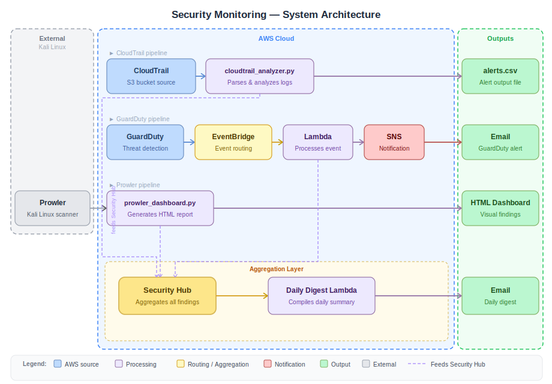

---

## 🛠️ Technologies Used

- **AWS** — CloudTrail, GuardDuty, Security Hub, Lambda, EventBridge, SNS, S3, IAM
- **Python 3.12** — Boto3, Pandas, Jinja2
- **Prowler v3.11.3** — CIS AWS Foundations Benchmark v1.4 compliance scanning
- **Kali Linux** — Prowler scan execution environment
- **Windows 11** — Primary workstation, AWS CLI, script development
- **MITRE ATT&CK** — Detection rule mapping framework
- **ASFF** — AWS Security Finding Format for Security Hub normalization

---

## 🎯 Skills Demonstrated

✅ CloudTrail log parsing and custom Python detection rule engineering  
✅ MITRE ATT&CK framework mapping across 6 attack categories  
✅ Real-time alerting pipeline: GuardDuty → EventBridge → Lambda → SNS  
✅ Attacker geolocation enrichment via IP API in Lambda  
✅ CIS AWS Foundations Benchmark v1.4 compliance scanning with Prowler  
✅ Custom HTML security posture dashboard generation from JSON output  
✅ AWS Security Hub ASFF normalization and multi-source aggregation  
✅ Scheduled Lambda daily digest with EventBridge cron  
✅ Hands-on remediation: root access keys, open security groups, EBS encryption  
✅ IAM least-privilege configuration and Boto3 automation  
✅ Linux CLI administration and Python scripting on Kali Linux  

---

## 🔍 Detection Logic

### CloudTrail Detection Rules — MITRE ATT&CK Mapped

| Category | Events Detected | Severity | MITRE ATT&CK |
|---|---|---|---|
| Anti-Forensics | `StopLogging`, `DeleteTrail`, `UpdateTrail` | CRITICAL | T1562.008 |
| IAM Escalation | `CreateUser`, `AttachUserPolicy`, `CreateAccessKey`, `CreateLoginProfile` | HIGH | T1098 |
| Network Exposure | `AuthorizeSecurityGroupIngress` with `0.0.0.0/0` | HIGH | T1190 |
| Resource Abuse | `RunInstances` in unexpected regions | MEDIUM | T1496 |
| Recon | `ListBuckets`, `DescribeInstances`, `ListUsers` | MEDIUM | T1580 |

### GuardDuty EventBridge Filter
```json
{
  "source": ["aws.guardduty"],
  "detail-type": ["GuardDuty Finding"],
  "detail": {
    "severity": [{ "numeric": [">=", 7] }]
  }
}
```

---

## 📊 Prowler CIS Compliance Results

### Initial Scan

| Metric | Value |
|---|---|
| Total checks | 67 |
| Failed | 67 |
| Critical findings | 4 |
| High findings | 18 |
| Medium findings | 39 |
| Low findings | 6 |

### Key Findings Detected

| Finding | Severity | Description |
|---|---|---|
| MFA not enabled on root account | CRITICAL | Root account accessible without second factor |
| Default VPC security group allows all traffic | HIGH | Zero Trust violation on default SG |
| AdministratorAccess policy attached | HIGH | Overly permissive IAM policy in use |
| MFA not enabled on IAM users | HIGH | Console users lack MFA protection |
| EBS default encryption disabled | MEDIUM | Data at rest unprotected by default |

---

## 🔧 Remediation Actions Taken

| Finding | Severity | Action Taken | Status |
|---|---|---|---|
| Root account MFA not enabled | CRITICAL | Enabled MFA on root via Security Credentials | ✅ Resolved |
| Default SG allows all traffic | HIGH | Restricted default security group rules | ✅ Resolved |
| EBS encryption disabled | MEDIUM | Enabled default EBS encryption in ca-central-1 | ✅ Resolved |
| CloudWatch metric filters missing | MEDIUM | Documented as future enhancement | 📋 Planned |


### After Remediation

| Metric | Value |
|---|---|
| Total checks | 76 |
| Passed | 35 |
| Failed | 41 |
| Compliance score | 46.1% |

---

## 📸 Screenshots

### ☁️ AWS Console — Account Setup
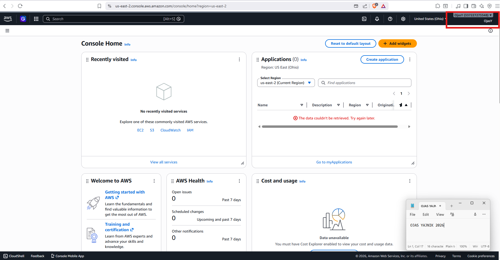

### 🔍 CloudTrail — Enabled and Logging
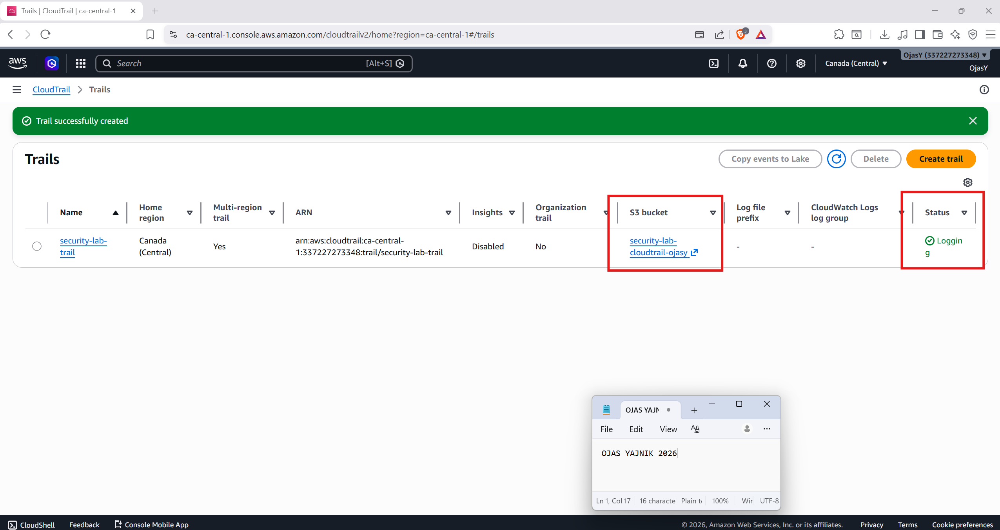

### 🔍 CloudTrail Analyzer — Suspicious Events Detected
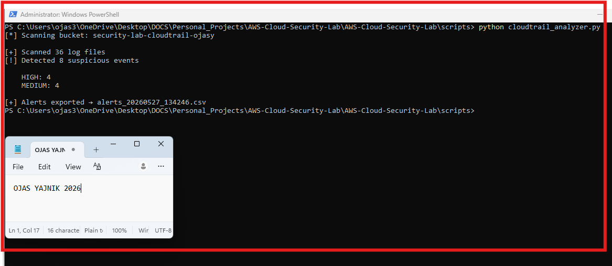

### 📄 Alerts CSV Export
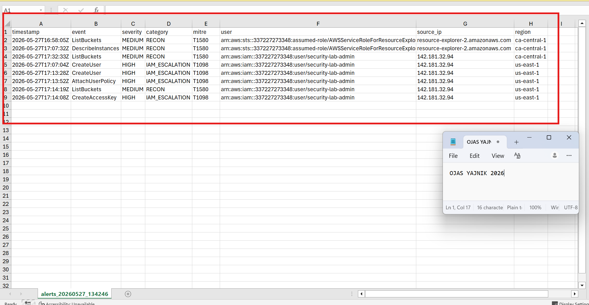

### 🛡️ GuardDuty — Enabled with Sample Findings
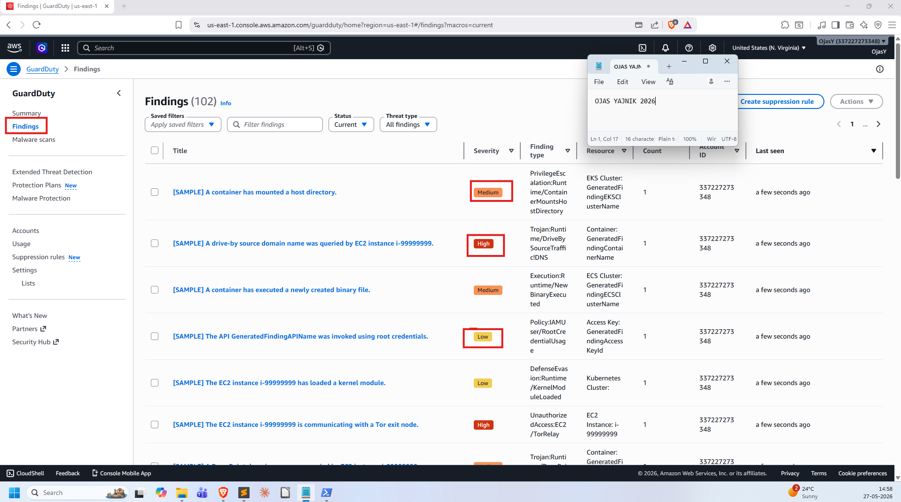

### 📧 Enriched Alert Email — with Attacker Geolocation
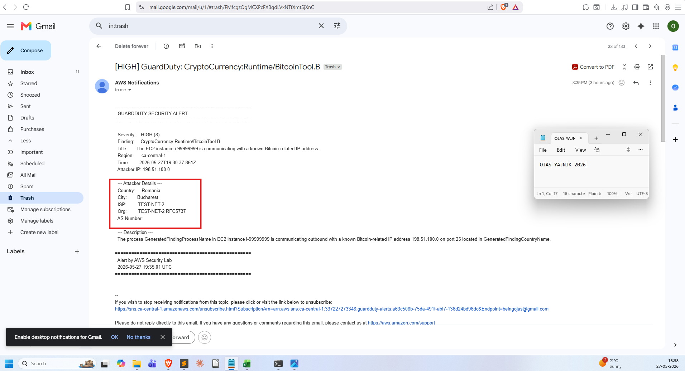

### 🔎 Prowler — Scan Running on Kali Linux
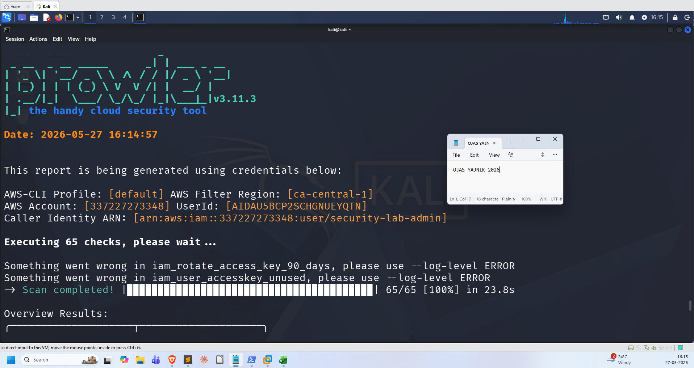

### 📊 Custom Compliance Dashboard
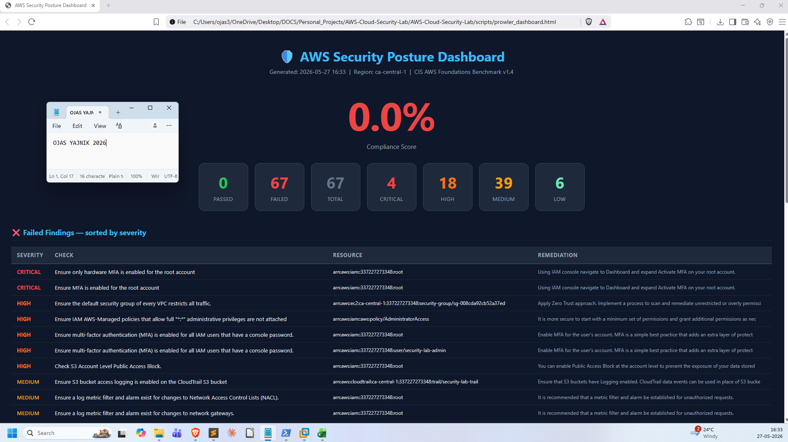

### 🏛️ Security Hub — Standards Enabled
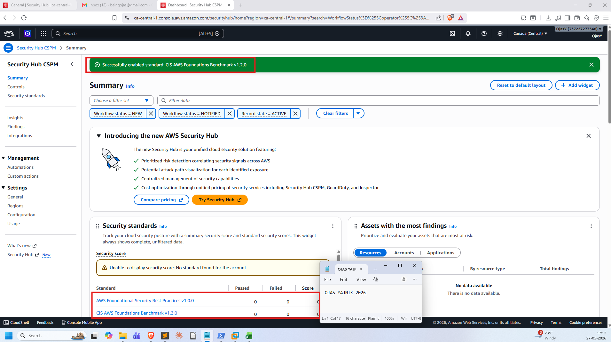

### 📥 CloudTrail Alerts Imported to Security Hub (CLI Proof)
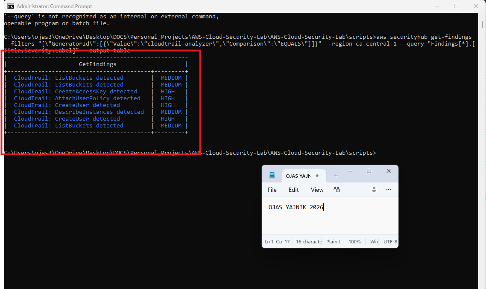

### 📬 Daily Digest Email
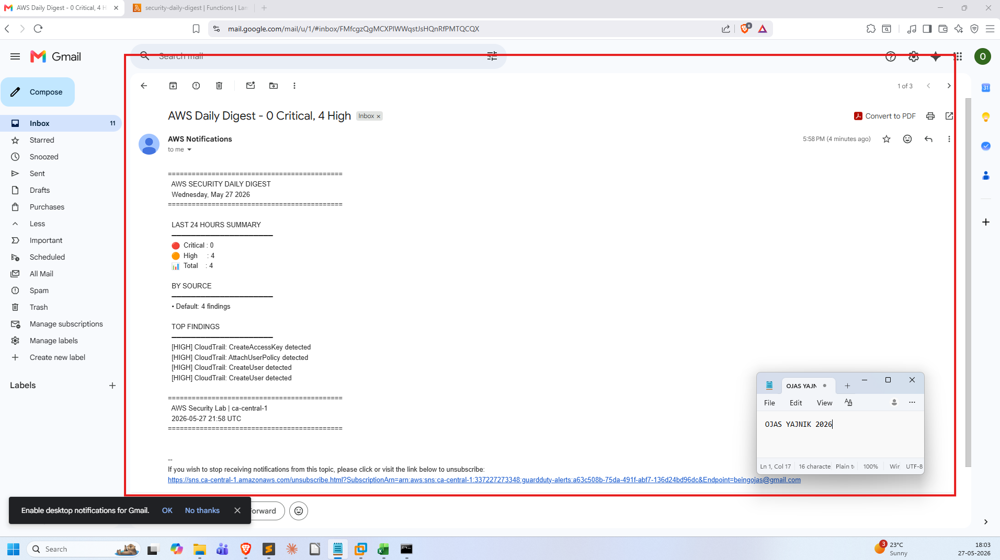

### 🔒 EBS Encryption Enabled
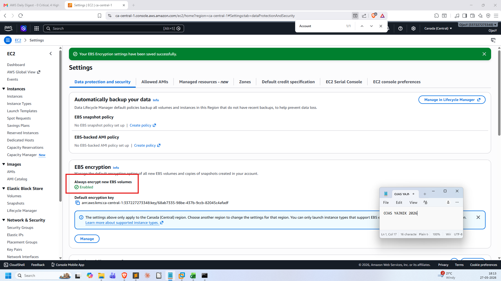

### 📈 Compliance Dashboard — After Remediation
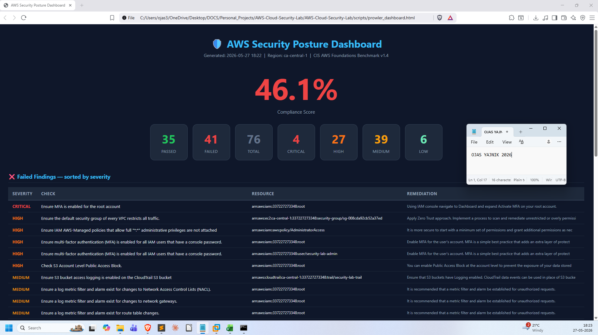

---

## 🚀 How to Reproduce This Lab

### Prerequisites
- AWS Account (Free Tier eligible)
- Python 3.10+
- AWS CLI configured with IAM user credentials
- Kali Linux (VM or native)
- Prowler v3.11.3 (`pip install prowler`)
- Boto3, Pandas, Jinja2 (`pip install boto3 pandas jinja2`)

### Step 1 — CloudTrail
```bash
# Enable CloudTrail in AWS Console with S3 storage
# Update BUCKET_NAME in the script
python scripts/cloudtrail_analyzer.py
```

### Step 2 — GuardDuty Alerting
```
Enable GuardDuty → Generate sample findings
Create SNS topic → Confirm email subscription
Deploy lambda_enricher.py to Lambda
Create EventBridge rule using configs/eventbridge_rule.json
Target: Lambda function
```

### Step 3 — Prowler Scan
```bash
prowler aws --region ca-central-1 --compliance cis_1.4_aws -M json-ocsf csv html -o ./scan_results
python scripts/prowler_dashboard.py ./scan_results
```

### Step 4 — Security Hub Integration
```bash
# Enable Security Hub in console with both standards
# Send Prowler findings
prowler aws --region ca-central-1 -S -M json-ocsf

# Import CloudTrail alerts
python scripts/import_to_securityhub.py

# Deploy daily_digest_lambda.py to Lambda
# Schedule with EventBridge cron: 0 13 * * ? *
```

---

## 📁 Repository Structure

```
📦 AWS-Cloud-Security-Lab
┣ 📂 screenshots
┃ ┣ 🖼️ 01-01-aws-console-home.png
┃ ┣ 🖼️ 02-01-cloudtrail-enabled.png
┃ ┣ 🖼️ 02-05-analyzer-output.png
┃ ┣ 🖼️ 03-02-guardduty-findings.png
┃ ┣ 🖼️ 03-08-enriched-alert-email.png
┃ ┣ 🖼️ 04-04-prowler-running.png
┃ ┣ 🖼️ 04-07-custom-dashboard.png
┃ ┣ 🖼️ 05-01-securityhub-enabled.png
┃ ┣ 🖼️ 05-03-cloudtrail-imported.png
┃ ┣ 🖼️ 05-07-daily-digest-email.png
┃ ┣ 🖼️ 06-04-ebs-encryption.png
┃ ┗ 🖼️ 06-05-improved-score.png
┣ 📂 diagrams
┃ ┗ 🗺️ architecture.png
┣ 📂 scripts
┃ ┣ 📜 cloudtrail_analyzer.py
┃ ┣ 📜 lambda_enricher.py
┃ ┣ 📜 prowler_dashboard.py
┃ ┣ 📜 import_to_securityhub.py
┃ ┗ 📜 daily_digest_lambda.py
┣ 📂 configs
┃ ┗ ⚙️ eventbridge_rule.json
┗ 📄 README.md
```

---

## 💰 Cost

Entire project runs on AWS Free Tier. GuardDuty has a 30-day free trial. Lambda provides 1M free requests/month. Total estimated cost: **< $5 CAD**.

---

## 👤 Author

**Ojas Yajnik**  
Cybersecurity enthusiast building hands-on security labs

[](https://www.linkedin.com/in/ojas-yajnik)
[](https://github.com/ojasy)

---

## 📖 References

| Resource | Link |
|---|---|
| AWS GuardDuty Documentation | [View Here](https://docs.aws.amazon.com/guardduty) |
| Prowler GitHub | [View Here](https://github.com/prowler-cloud/prowler) |
| MITRE ATT&CK Cloud Matrix | [View Here](https://attack.mitre.org/matrices/enterprise/cloud/) |
| CIS AWS Foundations Benchmark | [View Here](https://www.cisecurity.org/benchmark/amazon_web_services) |
| AWS Security Hub ASFF | [View Here](https://docs.aws.amazon.com/securityhub/latest/userguide/securityhub-findings-format.html) |

---

## 📜 License

MIT License — feel free to use this for your own learning.

---

## ⚠️ Disclaimer

This lab is built entirely for educational purposes using my own AWS account in a controlled environment. Never run these techniques against accounts or infrastructure you do not own or have explicit written permission to test.

---

🛡️ Built by Ojas Yajnik — May 2026
